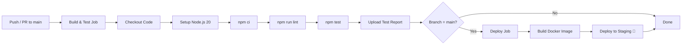

# MediQueue 🏥

> Healthcare Appointment & Consultation Manager — Agile & DevOps Assignment


## Overview
MediQueue is a RESTful healthcare API built with Node.js and Express. It demonstrates:
- **Agile methodology**: Scrum sprints, user stories, story points, epics
- **DevOps practices**: CI/CD pipeline, automated testing, Docker, GitHub Actions
- **Agile-DevOps integration**: Jira-GitHub linking, branch-per-story, automated transitions

## Features
| Story | Feature | Endpoint |
|-------|---------|----------|
| MQ-1 | Registration & OTP Login | POST /register, POST /login |
| MQ-2 | Search Doctors | GET /doctors |
| MQ-3 | Book Appointment | POST /appointments |
| MQ-4 | Cancel Appointment | DELETE /appointments/:id |
| MQ-5 | Create Prescription | POST /prescriptions |
| MQ-6 | Patient Dashboard | GET /dashboard |

## Quick Start

```bash
# Install dependencies
npm install

# Start the server
npm start

# Run tests
npm test

# Run linter
npm run lint

# Docker
docker build -t mediqueue .
docker run -p 3000:3000 mediqueue
```

## CI/CD Pipeline



## Project Structure
```
MediQueue/
├── src/
│   ├── app.js          # Express application
│   └── server.js       # Server entry point
├── tests/
│   └── app.test.js     # Jest + Supertest (TC01–TC07)
├── docs/
│   ├── EVIDENCE.md     # Screenshot checklist
│   ├── jira-setup.md   # Jira setup guide
│   └── jira-github-integration.md
├── jira/
│   └── mediqueue-backlog.csv
├── .github/
│   ├── workflows/
│   │   └── ci-cd.yml
│   └── pull_request_template.md
├── Dockerfile
├── .dockerignore
├── .eslintrc.json
├── package.json
└── README.md
```

## Test Cases
| ID | Description | Expected |
|----|-------------|----------|
| TC01 | Valid OTP login | 200 + token |
| TC02 | 3 wrong OTPs | 423 locked |
| TC03 | Search Cardiology | Only available cardiologists |
| TC04 | Book free slot | 201 + bookingId |
| TC05 | Double-book slot | 409 Conflict |
| TC06 | Cancel <2h before | 400 rejected |
| TC07 | Empty medicines | 400 rejected |

## Agile Artifacts
- **Backlog CSV**: `jira/mediqueue-backlog.csv` (import into Jira)
- **Sprint Plan**: Sprint 1 (MQ-1,2,6), Sprint 2 (MQ-3,4), Sprint 3 (MQ-5)
- **Total Story Points**: 36

## Documentation
- [Jira Setup Guide](docs/jira-setup.md)
- [Jira-GitHub Integration](docs/jira-github-integration.md)
- [Evidence Checklist](docs/EVIDENCE.md)

Note: Replace `Moheet10/MediQueue` in the badge URL above with your actual GitHub username and repository name.

